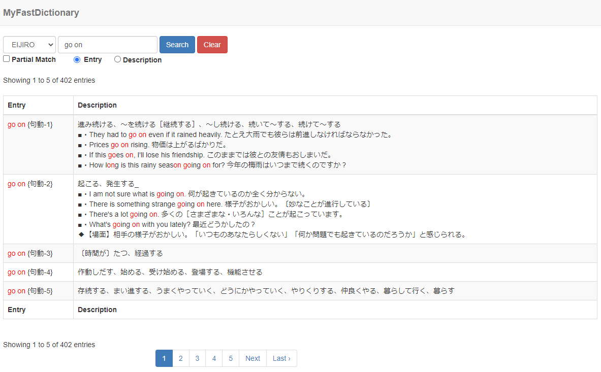
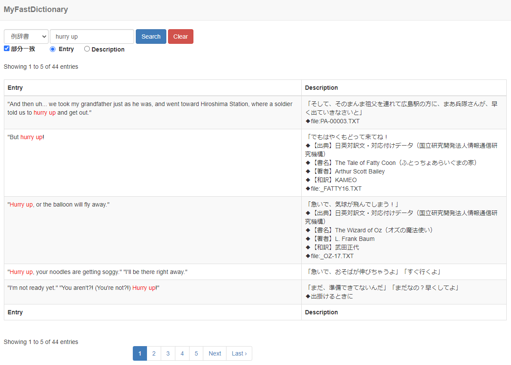

# MyFastDictionary


## What is MyFastDictionary?
MyFastDictionary is a web system for dictionaries.
This is very simple and very useful.  

I made it so that I can search Eijiro's data which is a famous dictionary data in Japan.
The structure of the database is simple, so you can convert from various formats. 


## Features
* It's a web system, so it's not related to the OS like Winodws, Mac, Android, iOS, Linux and so on.
* Full-text search for translations as well as words.
* No dependencies, just put the file and it will work.
* Dictionary data needs to be prepared separately.

## Screenshots
#### Screenshot1

#### Screenshot2

#### Screenshot3


## Dependencies
* PHP
* Web Server like Apache, Nginx etc
* SQLite3

## Using
* Codeigniter 3.1.5
* Bootstrap v3.3.7
* jQuery v3.2.1

## Installation
- Download myfastdictionary from GitHub
- Upload myfastdictionary in Document Root in Apache # /var/www/html/myfastdictionary
- Copy sqlite/sample.sqlite to sqlite/eijiro.sqlite, waeijiro.sqlite, reijiro.sqlite etc


## How to create Database
## Format
```
CREATE TABLE "dic" ( `entry` text, `desc` text )
```


## Database Configuration
### config/database.php
```
$db['eijiro'] = array(
	'dsn'	=> '',
	'hostname' => '',
	'username' => '',
	'password' => '',
    'database' => APPPATH.("../sqlite/eijiro.sqlite"),
	'dbdriver' => 'sqlite3',
	'dbprefix' => '',
	'pconnect' => FALSE,
	'db_debug' => (ENVIRONMENT !== 'production'),
	'cache_on' => FALSE,
	'cachedir' => '',
	'char_set' => 'utf8',
	'dbcollat' => 'utf8_general_ci',
	'swap_pre' => '',
	'encrypt' => FALSE,
	'compress' => FALSE,
	'stricton' => FALSE,
	'failover' => array(),
	'save_queries' => FALSE
);
```

### config/top_view.php
```
<select class="form-control" name="pulldown" id="pulldown">
    <option value="eijiro" <?php echo $select_eijiro; ?>>EIJIRO</option>
    <option value="waeijiro" <?php echo $select_waeijiro; ?>>WAEIJIRO</option>
    <option value="reijiro"<?php echo $select_reijiro; ?>>REIJIRO</option>
</select>
```

## Important Configuration

### application/config/config.php
```
//URL Settings
$config['base_url'] = '';
//$config['base_url'] = 'http://x.x.x.x/myfastdictionary/';
```


```
//Log Settings (applications/logs/log-*.php)
//0 = Disables logging, Error logging TURNED OFF
//3 = Informational Messages
$config['log_threshold'] = 0;
```


### controllers/Top.php

```
$config['per_page'] = "50";
```


## ChangeLog
v1.0
  * First Release